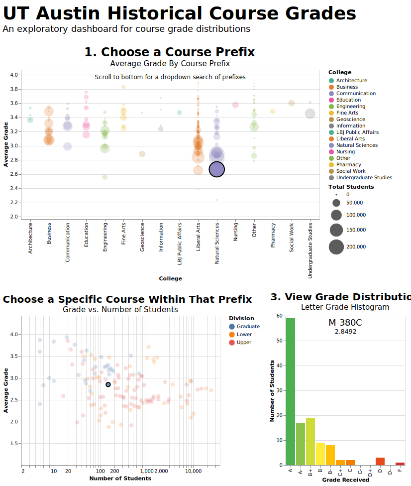

# UT Austin Historical Course Grades Dashboard

An interactive dashboard for exploring historical grade distributions across courses at the University of Texas at Austin. Built using Altair.



## Overview

This project processes 750,000+ grade records spanning 32 semesters (2010-2022) and creates an interactive, progressive Altair dashboard that allows users to:

- **Explore grade distributions by college and department** - Interactive scatterplot showing average grades across different course prefixes
- **Compare individual courses** - Filter by prefix to see specific courses with grade vs. enrollment trends
- **View detailed grade breakdowns** - Bar chart showing the full letter grade distribution for any selected course

Altair interactive charts are exported as html files; the data is embedded directly in the html, which makes the file large + slow with large datasets. To improve efficiency, the data for this dashboard is instead stored in a public Cloudflare R2 bucket and referenced by url in the html.

Note that this project was completed in May 2022 but only locally; this repo is just a quick cleanup + upload of the project.

## Installation + Usage

### Install
```bash
# Clone the repository
git clone <your-repo-url>
cd ut-grades-dashboard

# Install dependencies
uv sync
```

### Full Run
This will:
1. Process the raw data and create aggregated datasets
2. Generate the interactive dashboard at `output/ut-grades-dashboard.html`

```bash
uv run main.py
```

### Run Options
```bash
python main.py --help

Options:
  --prepare-only        # Only run data preparation step
  --visualize-only      # Only run visualization step (requires processed data to be present already)
  --download-raw        # Download the raw data to data/raw from public Cloudflare R2 buckets
  --upload-processed    # Upload processed datasets to S3-compatible storage; requires .env file
```
